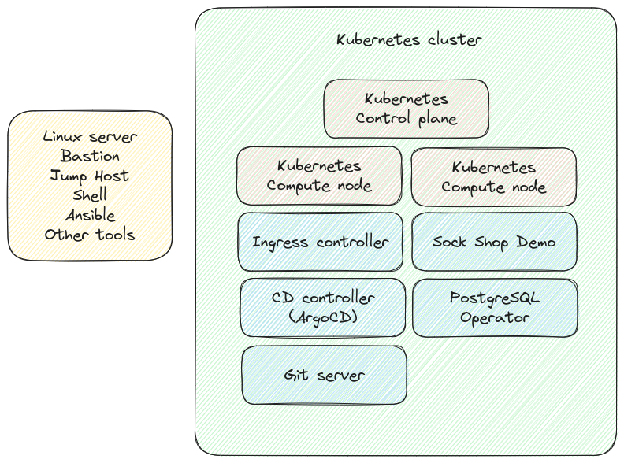

# Academy project - task 1

### 1. Introduction

This High Level Design (HLD) document gives insight on how to create a virtual linux server and configure a kubernetes cluster with different deployments such as Gitlab, Postgresql, Sockshop, Prometheus and Grafana. It describes the technology used to achive the final product.

### 2. System architecture

This solution can be divided into three parts:
1. Creation and configuration of a virtual server.
2. Creating kubernetes cluster inside the virtual server. 
3. Configuring the kubernetes cluster and installing different applications in the cluster.

### 3. Requirements
There were some certain requirements for technology, but there were also options available to meet those requirements. 
This table provides an overview of the requirements, available options, and the chosen solution. 

| Requirements|  Options | Solution | 
| ------ | ------ | ------ | 
|Linux server | Any linux distribution| Ubuntu 22.0       |        
|Number of CPU, memory- and storage - capacity |  Servers with 2-4 vCPU and at least 16GB RAM each| 4vCPU, 16GB RAM and 160GB total disk      |        
|Kubernetes| Any kubernetes distribution |Kind       |        
| Ingress controller       | Nginx or Traefik       |   Nginx     |        
| Helm      |        |   Helm     |  
| Gitlab|  | Install gitlab with helm chart |
|Prometheus and Grafana for monitoring | Prometheus stack| Installed prometheus stack using helm |
|Sock shop application| | Sock shop application|

