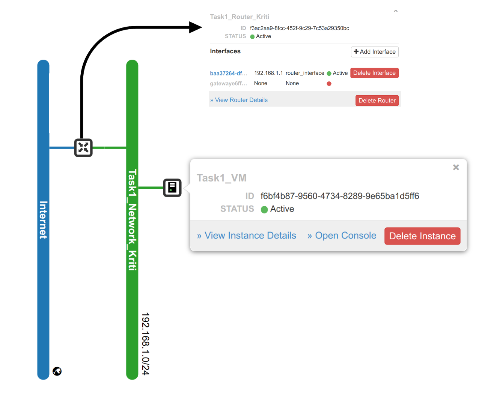
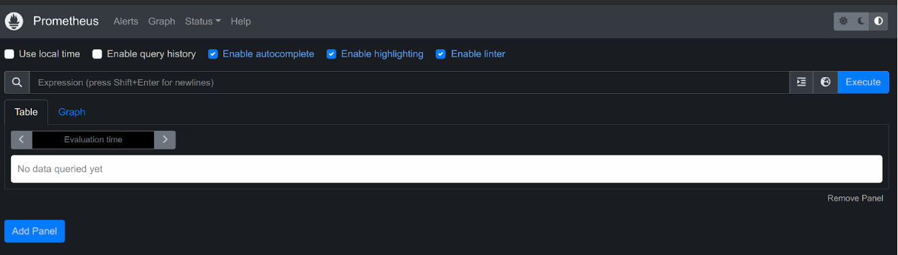
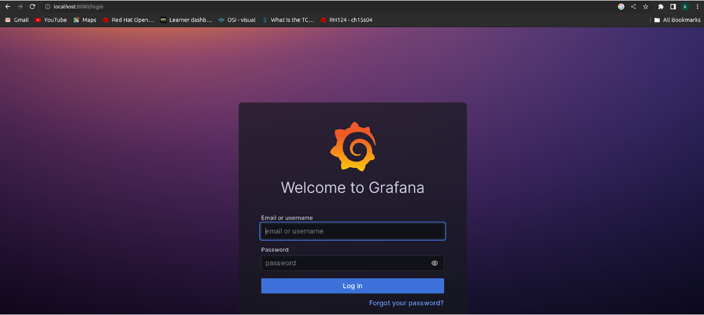
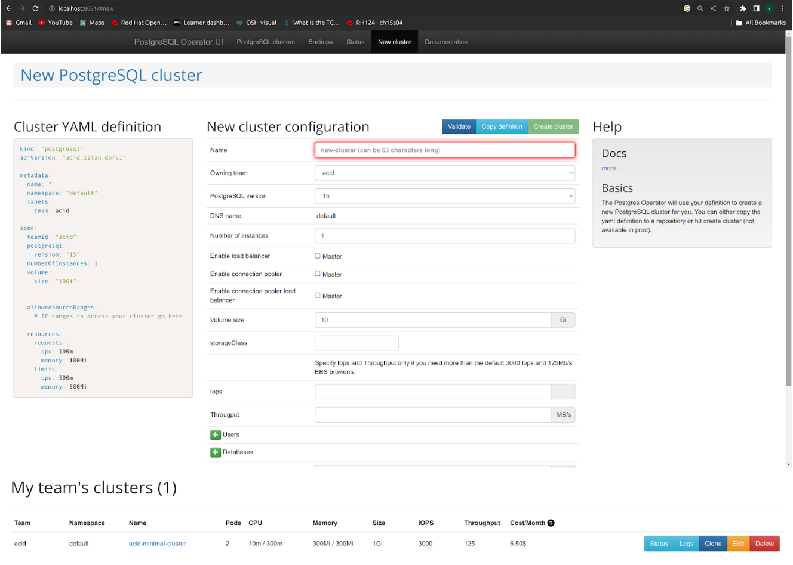

# Academy project - task 1

### 1. Introduction

"Academy project - task 1" is a project task with a goal for academy participants to test the knowledge they have gathered through the workshops. The main task is to create a virtual server and create a kubernetes cluster in it. In addition, the task requires some configuration and installation of some application in the cluster. This document intends to provide an overview upon completion of the project. 

### 2. Implementation 

###### 2.1  Linux server in RLNC

 Firstly, a network and router must be created in order to start an instance of linux server. While creating a network, we must add some configuration such as network name, subnet name and network address. The router is configured with a name and is connected to "Internet" which is an external network. After the network and router are created, they must be connected by adding the subnet as an interface to that router.

    Configuration of network:
        Network name: Task1_Network_Kriti
        Subnet name: Task1_Subnet_Kriti
        Network address: 192.168.1.0/24
     

    Configuration of router: 
        Router name: Task1_Router_Kriti
        External network: Internet
        

After the network and router are sucessfully created, the next step is to create a security group. The security group contains firewall rules that we will implement while launching a server instance.

    Security group configuration:
        Security group name: Task1_SecurityGroup
        Egress rules: All the outbound traffic is allowed.  
        Ingress rules: Only TCP ports 80 and 443 are allowed

Next step is to create a virtual server. Here we will add the mandatory information like instance name, numbers of CPU, memory- and storage size, linux distribution, security group and SSH public key. The SSH key will let us log into the virtual machine (VM).

    VM configuration:
        Instance name: Task1_VM
        Flavor: oslodevops.4cpu.16ram.160disk (This flavor provides a virtual server with 4 CPU, 16GB RAM and 160GB disk)
        Source image: ubuntu-22.04
        Security group: Task1_SecurityGroup
        Public key: ~~~~

When the VM is launched, we need to allocate an public IP to the project. This public will allow us to connect to VM and it will have accesss to the internet.After the VM is up and running, we will establish an SSH connection to the VM and proceed with the remaining tasks there.  

    Public IP assigned for the VM:  87.238.54.90
    Log in command: ssh ubuntu@87.238.54.90

An illustration of network topology is given in Figure 1. This diagram shows the connection between different network components.   
{ width=50% }[Figure 1: Network topology]

###### 2.2  Kubernetes installation

KIND stands for Kubernetes IN Docker and requires Docker to be pre installed. Therefore we started off with installing docker in our VM by following the guide provided by docker.  

    Docker installation guide: https://docs.docker.com/engine/install/ubuntu/

After installation of docker, we moved ahead to install Kind using guide provided by Kind.

    Kind installation guide: https://kind.sigs.k8s.io/docs/user/quick-start/#installing-from-release-binaries

NB! It is important to make sure that the installation method is suitable for ubuntu version 22.04. This applies to guides mentioned in the document so far and those that will be introduced later. 

###### 2.3  Cluster creation

With Kind being successfully installed, we are now able to create kubernetes cluster. There are multiple ways of creating a cluster, but in this case we used a [configuration file called k8sConfig.yaml](/k8sConfig.yaml). This file specifies that we are configuring a KIND cluster and an API version. Additionally it includes what name the cluster should have, the number of nodes and role of the nodes in this cluster.

    Command to create the cluster with configuration file:
    sudo kind create cluster --config k8sConfig.yaml
    
    Command to check if the cluster is created:
    sudo kind get clusters 
    - Execution of the following command will list name of the cluster "task-1-cluster".     

###### 2.4  Cluster configuration 
Once the cluster is generated, the next step is to access the cluster by using the following tools: Kubectl and Helm. These tools must first be installed. 

2.4.1 Kubectl

This commandline tool is installed by following the guide provided by official kubernetes website. 
    
    Kubectl installation guide: 
    https://kubernetes.io/docs/tasks/tools/install-kubectl-linux/#install-using-native-package-management

2.4.2 Helm 

A quickstart guide is made available by Helm. By following the tutorial, we were able to access helm in our VM.
    
    Helm installation guide: 
    https://helm.sh/docs/intro/install/

2.4.3 Cluster key

A cluster access key is automatically generated when the cluster is created. This is an access key used by tools like Kubectl and Helm to communicate with the cluster. 

The cluster access key is first saved in root user directory which we moved to normal user directory.

    sudo mv /root/.kube/config ~/.kube/config
Then the ownership is changed to normal user. 

    sudo chown ubuntu:ubuntu ~/.kube/config
At last the enviroment variable is set using the command: 

    export KUBECONFIG="$KUBECONFIG}:${HOME}/.kube/config"

###### 2.5 Cluster monitoring 
 Prometheus and Grafana are used to monitor the cluster. Those tools are installed using Helm chart called kube-prometheus-stack. This stack include both Prometheus and Grafana. The commands used to set them up:

Prometheus installation:
    
    helm repo add prometheus-community https:/ /prometheus-community.github.io/helm-charts

    helm install my-kube-prometheus-stack prometheus-community/kube-prometheus-stack --version 51.2.0 --create-namespace -n prometheus -kubeconfig .kube/config

Portforwarding Prometheus:

    kubectl -n prometheus port-forward service/my-kube-prometheus-stack-prometheus 9090:9090 &

Portforwarding Grafana: 

    kubectl -n prometheus port-forward service/my-kube-prometheus-stack-grafana 8080:80 &

These are then accessable through browser as shown on the picture below.

{ width=50% }[Figure 2: Prometheus Dashboard available at localhost:9090]

{ width=50% }[Figure 3: Grafana available at localhost:8080]

###### 2.6 Other application
2.6.1 Gitlab
Gitlab was also installed using Helm chart. The purpose here was just to understand Helm charts and was therefore less focus on Git. 

Command used to install Git:

    helm install gitlab gitlab/gitlab  --set global.hosts.domain=gitlab.example.com --set certmanager-issuer.email=me@example.com --create -namespace -n gitlab --kubeconfig .kube/config

2.6.2 Postgresql 

For Postgresql two different Helm charts were added and installed. One is postgres-operator and another one is operator-UI. 

Commands used to install the tools:

    helm repo add postgres-operator-charts https://opensource.zalando.com/postgres-operator/charts/postgres-operator

    helm install postgres-operator postgres-operator-charts/postgres-operator --create -namespace -n postgres --kubeconfig .kube/config

    helm repo add postgres-operator-charts https://opensource.zalando.com/postgres-operator/charts/postgres-operator-ui
    
    helm repo update

    helm install postgres-operator-ui postgres-operator-ui-charts/postgres-operator --create -namespace -n postgres-operator-ui --kubeconfig .kube/config
    

The UI was port forwaded and made available at port 8081 by using the command:

    kubectl -n postgres-operator-ui  port-forward service/postgres-operator-ui 8081:80 &
Then using a yaml file called [minimal-postgres-manifest.yaml](minimal-postgres-manifest.yaml), a postgres cluster is created. The yaml file is run using the command: 
    
    kubectl create -f minimal-postgres-manifest.yaml
That cluster is then visible at postgresUI as shown in the image below.  

{ width=50% }[Figure 4: Postgres UI and the cluster available at localhost:8081]

2.6.3 SockShop

Microservice called SockShop was ran in the cluster to test the fundamental functionality of the cluster itself. 

First clone the application: 

    Git clone: git clone https://github.com/microservices-demo/microservices-demo

Then go to correct directory : 
    
    cd microservices-demo/deploy/kubernetes/

Apply the yaml file: 
    
    kubectl apply -f complete-demo.yaml

At last port forward and get access to the sock-shop : 
    
    kubectl -n sock-shop port-forward service/front-end 30001:80 &

The service was available on browser as it is shown in the picture below.

{ width=50% }[Figure 1: Network topology]

###### 2.7 Port forwarding
Different ports that are assigned for different applications: 

30001 → sockshop

8080 → grafana 

9090 → prometheus

30236 → Gitlab

8081 → Postgres UI

Portforward form PC: 

    ssh -L 8080:localhost:8080 -L 9090:localhost:9090 -L 8081:localhost:8081 -L 30001:localhost:30001 -L 30236:localhost:30236 ubuntu@87.238.54.90

Portforward sockshop: 

    kubectl -n sock-shop port-forward service/front-end 30001:80 &

Portforward grafana: 

    kubectl -n prometheus port-forward service/my-kube-prometheus-stack-grafana 8080:80 &

Portforward prometheus: 

    kubectl -n prometheus port-forward service/my-kube-prometheus-stack-prometheus 9090:9090 &

Portforward gitlab: 

    kubectl -n gitlab port-forward service/gitlab-nginx-ingress-controller 30236:80 &

Portforward postgres-operator-ui : 

    kubectl -n postgres-operator-ui  port-forward service/postgres-operator-ui 8081:80 &

